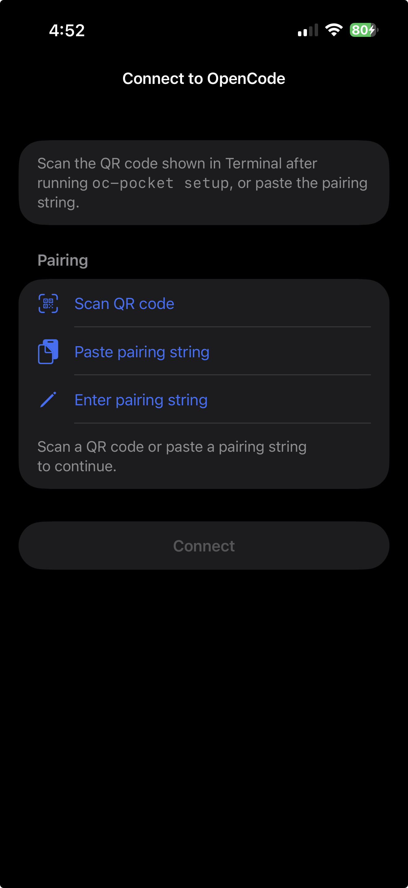
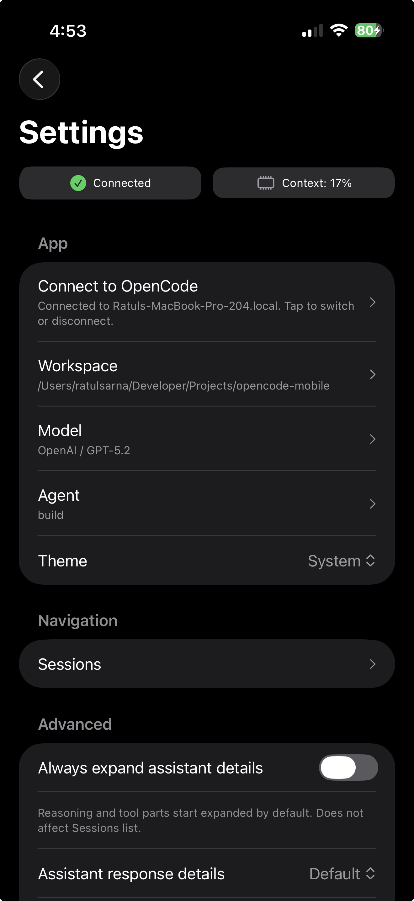
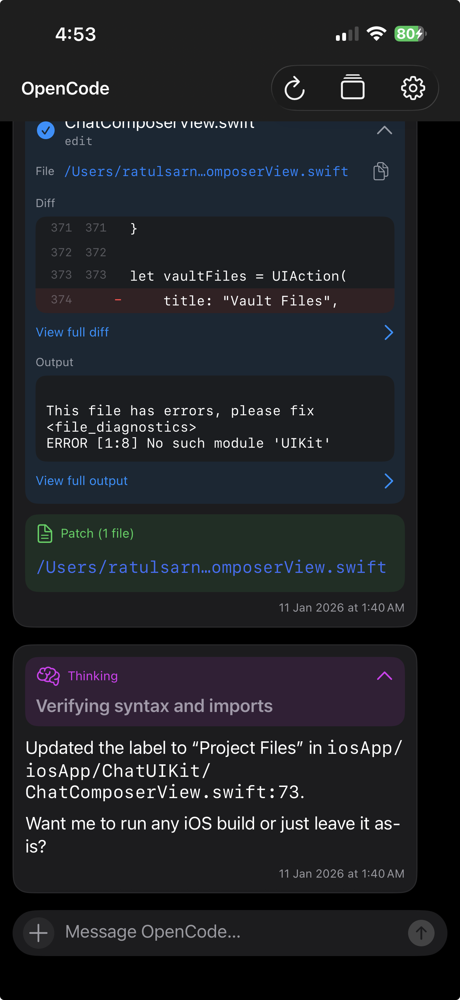
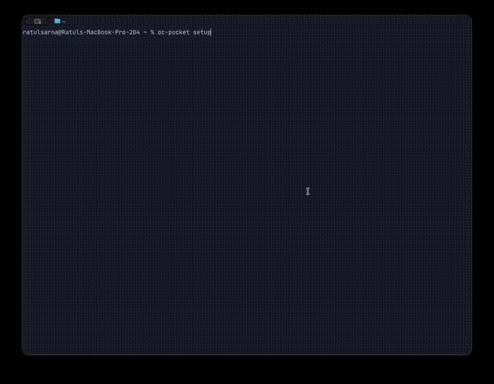

# OpenCode Pocket

OpenCode Pocket is an **iPhone-first iOS client for OpenCode**. OpenCode runs on your Mac; `oc-pocket` helps you pair your phone to your Mac reliably.

What you can do: chat (streaming), switch sessions, pick agent/model, browse files, see full diffs.

<p>
  
  
  
</p>

## Quickstart

### Prerequisites

- macOS + Xcode
- OpenCode installed on your Mac: `https://github.com/anomalyco/opencode`

### 1) Install `oc-pocket` on your Mac

Install via `curl`:

```bash
curl -fsSL https://raw.githubusercontent.com/ratulsarna/opencode-pocket/main/scripts/install-oc-pocket.sh | sh
```

This installs the latest macOS universal `oc-pocket` binary (defaults to `/usr/local/bin`).

### 2) Start the companion on your Mac

Run:

```bash
oc-pocket setup
```

Demo (CLI pairing):



This prints a **QR code** and a copy/paste **pairing string**.

Choose a connection mode when prompted:

- **Private, works anywhere (Recommended)**: Tailscale
- **On my Wi‑Fi only**: Local Network
- **Localhost only (Developer)**: mainly for simulator/dev

### 3) Build the iOS app from source and pair

- Open the Xcode project: `open iosApp/iosApp.xcodeproj`
- Build and run scheme: `iosApp`

If you’re running on a real iPhone, set your Team in Xcode:

- Option A (recommended): Xcode → target `iosApp` → Signing & Capabilities → select your Team
- Option B: set `TEAM_ID=` in `iosApp/Configuration/Config.xcconfig`

In the app:

- Open **Settings → Connect to OpenCode** (or the app will show the Connect screen if not paired yet)
- Scan the QR or paste the pairing string

## Troubleshooting

- QR scanning is **device-only**; on simulator use **Paste pairing string**.
- Local Network mode: iOS Settings → your app → enable **Local Network**.
- 401 Unauthorized: re-pair (or rotate token on Mac and re-pair).
- **LaunchAgent prompts**: macOS may notify that `oc-pocket` can run in the background (Login Items & Extensions).

## Project links

- Contributing: `CONTRIBUTING.md`
- Security: `SECURITY.md`
- Changelog: `CHANGELOG.md`
- Repo/agent notes (development): `AGENTS.md`
